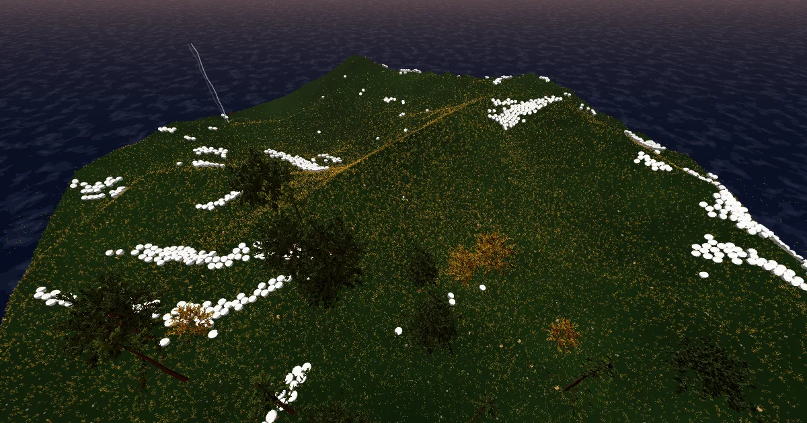

# Sheep Dog Simulator

[](https://sheepdogsim.com) &nbsp; [](LICENSE) &nbsp; [](https://github.com/matthew-kissinger/sds)

[](https://threejs.org/) [](https://react.dev/) [](https://vite.dev/) [](https://tailwindcss.com/) [](https://developers.cloudflare.com/workers/) [](https://vitest.dev/) [](tests/)

**Herd up to 5,000 sheep across three biomes in your browser, on your phone, with friends, at 60fps.** No install, no signup, no ads. Free. MIT-licensed. Built to be forked.

> [Play it now → sheepdogsim.com](https://sheepdogsim.com)



---

## Why this exists

Most WebGL games are tech demos with no game inside, or closed-source mobile-clone ports with no tech to learn from. **This is neither.** It's a polished, fully playable 3D game whose source you can read end-to-end in an afternoon and ship a personal mod of by the weekend.

The whole stack:

- **Client engine:** ~10k lines of vanilla JavaScript (no JSX, no codegen, no wasm)
- **Server:** ~600-line TypeScript Cloudflare Worker with Durable Objects and D1
- **Shared sim:** deterministic boid + obstacle modules imported byte-identically by both
- **Tests:** 201 specs (Vitest 4) covering atmosphere, heightfield, scene-obstacles, island-boundary, tree-placement, sim-baseline, integration harness, practice-mode, SEO

If you're learning 3D web games, real-time multiplayer on edge compute, or large-scale boid simulation, this codebase is a rare opportunity to read a complete shipped product instead of yet another minimal example.

---

## What's actually in here

### 🐑 5,000-sheep flocking in a single draw call
- GPU-instanced sheep via Three.js `InstancedMesh` + custom vertex shader (legs and heads animate per-instance)
- Force-based steering on **real obstacles** — sheep + dog actually route around tree trunks, large rocks, and terrain via a deterministic [`kdbush`](https://github.com/mourner/kdbush) spatial index
- Adaptive boid AI: tighter cohesion at higher counts so 5,000 sheep stay readable instead of dissolving into noise

### 🌍 Three hand-built biomes
| Scene | Shape | Hook |
|---|---|---|
| **Home Field** | Flat fenced rect (±100 m) | Single perimeter pen, gate-passage retirement. The starter. |
| **Rolling Hills** ⭐ | 180 m island with rolling heightfield | Lightning-zap corral, water + Mediterranean tree mix, golden-hour mood. The hero scene. |
| **Open Country** | 380 m island (~4.2× area) | Multi-stage objective: gather **40 sheep into the round-up zone for 2 sec**, then drive them through a magical portal at the north shore. |

### 🎮 Six gameplay modes
- **Just Play** (Practice Paddock — 30 sheep, no timer, no fail state) — *new in v2.1.0*
- **Solo Classic** (200 sheep, scene-default goal, leaderboard)
- **Solo Extreme** (1,000 sheep)
- **Solo Insane** (3,000 sheep)
- **Solo Chaos** (5,000 sheep — the flock is the antagonist)
- **Multiplayer:** 2–4 player real-time co-op + competitive rooms + 3-minute timed mode + 2-player local split-screen + sandbox editor with shareable URLs

### ⚡ Authoritative 60 Hz multiplayer on Cloudflare's edge
- Durable Objects host per-room sim — rooms live wherever Cloudflare schedules them, no cold start
- MessagePack-over-WebSocket state frames; client adaptive-jitter-buffer widens automatically as RTT stddev rises
- D1 leaderboards with per-mode best times and a discriminator-based identity (#0001-style tags)
- Reconnect grace window — drop a tab and rejoin within 15 s without losing your run

### 🎨 Cinematic visual layer
- **Hosek-Wilkie analytic sky** with day/night presets, parallax cloud layer, water with sun-glint, billboarded sun disc
- **Hundreds of thousands of grass blades** with directional wind shader, dog-bends-grass-along-its-facing interaction, per-scene density tuning, stochastic-dither LOD
- **Apple-correct tone mapping** — Mac/iPhone/iPad use Neutral instead of ACES so the sky doesn't wash white on Metal-ANGLE
- Per-scene tree LOD + impostor atlases (Mediterranean / Pacific-NW species mix)
- Three camera modes: **Classic** (top-down isometric), **Follow** (cinematic chase with ridge-clearance lift), **Free** (mouse-yaw orbit)

### 🌐 Mobile + i18n + accessibility
- Touch joystick + on-screen sprint button + responsive HUD; PWA-installable from any browser
- Full gamepad support (analog stick + buttons)
- 5 languages: English, Spanish, Portuguese, Japanese, Simplified Chinese ([more contributions welcome](js/locales/))

### 🔬 SEO + share-ready
- Per-scene metadata: `<title>`, `og:image`, `og:title`, `og:description`, `twitter:*` all switch on `?scene=X` deeplink — *new in v2.1.0*
- Schema.org `VideoGame` + `FAQPage` + `WebApplication` structured data
- Lighthouse SEO **100 / 100**

---

## Try it locally in 30 seconds

Requires Node 22+ and a modern browser (Chrome 80+, Firefox 75+, Safari 13+, Edge 80+).

```bash
git clone https://github.com/matthew-kissinger/sds.git
cd sds
npm install
npm run dev:setup      # apply D1 migrations to local sqlite (one-time)
npm run dev            # vite (:3000) + wrangler (:8787) together
```

Then open [http://localhost:3000](http://localhost:3000).

Granular alternatives:
```bash
npm run dev:client     # just Vite (no multiplayer worker)
npm run dev:worker     # just wrangler
npm run dev:lan        # vite --host + wrangler (LAN-accessible — for mobile testing)

npm test               # Vitest — 201 specs in ~1.5s
npm run build          # production output to dist/
```

URL params for fast scene picking + shoot setup:
- `?scene=field` — Home Field
- `?scene=rolling-hills` — Rolling Hills (default)
- `?scene=open-country` — Open Country
- `?cinematic=1` — exposes `window.__sdsCinema` for scripted captures + free-fly camera + tone-map override
- `?ui=off` — hide React overlay (canvas-only render)
- `?sun=N` — N in 0..1 (`0.06` = dusk, `0.20` = golden hour, `0.50` = noon)

---

## Controls

| Input | Desktop | Mobile |
|---|---|---|
| Move | W A S D / Arrows | Virtual joystick (bottom-left) |
| Sprint | Shift (drains stamina; locks until released after empty) | Sprint button above joystick |
| Camera mode | C (cycles Classic / Follow / Free) | Tap the camera-mode chip on the HUD |
| Zoom | Mouse wheel | Slider (bottom-right) |
| Pause | Escape | Pause button on the HUD |
| Gamepad | Full analog support | — |

Camera modes: **Classic** (high-isometric, world-axis WASD), **Follow** (close cinematic chase, camera-relative WASD, ridge-clearance lift), **Free** (mouse-yaw orbit on top of Follow's pitch). Per-scene preference is remembered in localStorage.

---

## Architecture (one-page version)

```
┌─────────── CLIENT (Cloudflare Pages) ──────────────────────────────────┐
│                                                                         │
│  StartScreen → GameState → OptimizedSheep → SceneManager                │
│       ↓             ↓             ↓              ↓                      │
│  MobileControls  InputHandler   Sheepdog    TerrainBuilder              │
│       ↓             ↓             ↓              ↓                      │
│  AudioManager   GamepadManager  GrassSystem   Atmosphere + Effects      │
│       │             │             │              │                      │
│       │             │             │              ├── HosekWilkieSky     │
│       │             │             │              ├── CloudLayer         │
│       │             │             │              ├── SunBillboard       │
│       │             │             │              ├── PortalEffect       │
│       │             │             │              └── CorralZapEffect    │
│       └─────────────┴──── shared/ deterministic kernels ──────────┐     │
│                       (boid, MovementPhysics, BoundaryCollision,  │     │
│                        TreePlacement, SceneObstacles, scenes/)    │     │
│                                                                   │     │
│                    NetworkManager                                 │     │
│            (WebSocket + MessagePack + fetch, adaptive jitter buffer)    │
└────────────────────────────────┬────────────────────────────────────────┘
                            HTTPS │ WSS
┌────────────────────────────── ▼ ── SERVER (Cloudflare Worker) ─────────┐
│                                                                         │
│  index.ts                                                               │
│    ├── HTTP:  /api/register, /api/rooms, /api/score, /api/leaderboards  │
│    └── WS:    /r/:code/ws → RoomDO                                      │
│         ↓                                                               │
│  RoomDO   — per-room, runs GameSim at 60 Hz, broadcasts state frames    │
│  LobbyDO  — singleton, public lobby list + quick-match + room codes     │
│         ↓                                                               │
│  D1 (sds-db)                                                            │
│    ├── players                  (materialized best per mode + identity) │
│    ├── discriminators           (#0001 allocation)                      │
│    └── score_submissions        (audit trail)                           │
└─────────────────────────────────────────────────────────────────────────┘
```

The `shared/` modules import byte-identically into both client (Vite) and worker (esbuild) — flocking, obstacle queries, boundary collision, tree placement, and scene definitions all live there so solo and multiplayer agree on physics. The sim-baseline test pins a deterministic Field run to JSON fixtures and has stayed bit-identical across cycles 5–26.

Full diagrams + network protocol + module-level details: [ARCHITECTURE.md](ARCHITECTURE.md).

---

## Tech stack

**Client:** Three.js 0.184 · React 19.2 · Vite 7.3 · Tailwind 4.1 · @msgpack/msgpack 3 · i18next 25 · lz-string · nipple.js · kdbush

**Server:** Cloudflare Workers · Durable Objects · D1 · wrangler 4

**Shared:** `shared/` deterministic boid + physics + obstacle modules, imported by both runtimes

**Testing:** Vitest 4.1 (201 specs · 17 files · ~1.5 s full run) covering atmosphere, heightfield, scene-obstacles, island-boundary, tree-placement, sim-baseline, integration harness, practice-mode contracts, SEO. Playwright for browser smoke + perf-baseline harness.

---

## Recent ships (current cycle)

We work in numbered cycles; each ship is a `vN.N.N` tag with a CHANGELOG entry. The last twelve cycles delivered everything you see today; here's where the surface is moving right now:

- **`v2.1.1`** (2026-05-08) — OG card refresh: new Rolling Hills dusk + Field farmhouse social-share images. `_headers` cache TTL added so future asset refreshes propagate fast at the CF edge.
- **`v2.1.0`** (2026-05-08) — **Practice Paddock** (30-sheep no-pressure mode at position 0 of the mode picker, with first-visit pulsing-glow nudge gated by `localStorage`) + **per-scene SEO** (`document.title` + full `og:*` + `twitter:*` switch on every scene change).
- **`v2.0.5`** — deleted dead `AtmosphericDesatPatch` machinery (~190 LOC) — final piece of the Cycle 25 polish-program cleanup.
- **`v2.0.4`** — extended Apple tone-mapping branch from Mac to iPhone/iPad to fix the iOS water-sheen wash.
- **`v2.0.3`** — Mac white-hue fix (ACES → Neutral on Mac platforms; the sky-blue fog was pushing toward white through ACES + extended-sRGB on Metal-ANGLE).
- **`v2.0.0`** (Cycle 25 close) — eight-phase polish-mega-cycle: validation infrastructure, LOD truth (drop LOD1 desktop), HeightFogPatch foundation, per-mode camera zoom + persistence, per-scene tree distribution profiles, shimmer-skeleton scene-swap overlay.

[CHANGELOG.md](CHANGELOG.md) has the full per-version log; [docs/BACKLOG.md](docs/BACKLOG.md) keeps per-cycle headlines; [DECISIONS.md](DECISIONS.md) is the chronological "why" record.

---

## Roadmap — where we'd love help

The backend on Cloudflare's edge is solved-as-far-as-it-needs-to-be. The visual layer ships at 60fps on most hardware. What's left is content depth, dynamic life, and rough edges. **Each item below is a real PR-able piece of work** — issue numbers welcome.

- **Dynamic weather + time-of-day as gameplay levers.** The Hosek-Wilkie sky already supports dawn/noon/dusk/golden/overcast presets; wiring a `DayNightCycle` driver where sheep flocking tightens at dusk and visibility drops in fog turns atmosphere into mechanic.
- **More multi-stage objectives** beyond Open Country's gather→drive. River crossings, predator-flushing, lost-sheep recovery, scattered sub-flocks at multiple cardinal directions — each unlocked by data in `shared/scenes/*.js` rather than new code paths.
- **Predators + NPCs.** Wolves/strays as obstacle-aware boids using the same `SceneObstacles` index sheep already query. A second AI shepherd that competes or assists.
- **Mod-friendly scene format.** Sandbox already uses lz-string-encoded URLs; growing this to full scene descriptions (heightmap + tree zones + woods clusters + objective def) so a custom biome ships as a link.
- **Spherical-billboard impostors.** The Cycle 18 octahedral atlas bakes 16 views per species (4 azimuth × 4 elevation) but the runtime quad still billboards around world-Y only — high-elevation atlas tiles render edge-on from cinematic camera altitudes. A proper spherical billboard with a square-tile bake unlocks the overhead shots.
- **Competitive seasons + tournaments** once the leaderboard has enough player history to make them meaningful.

---

## Contributing

This codebase is **deliberately easy to read**. Whether you want to mod the game, use it as a reference for a 3D browser project of your own, or ship a PR, here's the recommended reading order:

1. [ARCHITECTURE.md](ARCHITECTURE.md) — module map, render pipeline, network protocol
2. [DEVELOPMENT.md](DEVELOPMENT.md) — local setup, dev servers, mobile testing, mp testing
3. [DECISIONS.md](DECISIONS.md) — chronological "why we made the calls we did"
4. [docs/BACKLOG.md](docs/BACKLOG.md) — per-cycle "what shipped" headlines
5. [docs/INTERFACE_FENCE.md](docs/INTERFACE_FENCE.md) — files where stability matters more than ergonomics
6. [docs/README.md](docs/README.md) — full doc navigation index (Diátaxis-tagged) — start here if you want a full map of the docs tree

### Good first issues — concrete things a PR could fix

- **More languages.** i18n keys live in [js/locales/](js/locales/); PRs add a new directory + JSON files. Today: 5 languages (en, es, ja, pt, zh-CN). Want German? French? Korean? Open a PR.
- **Dog GLB compression** via gltf-transform + Draco. Each dog is 25–40k triangles; five dog models. Trims the bundle.
- **Better mobile perf.** Current target is 30–60fps on mid-range Android; getting reliable 60 would help a lot of users.
- **MP joiner renderer sync.** Joiners whose URL-param scene differs from the room's see correct sim but mismatched visuals.
- **LOD2 → LOD0 cross-fade** at the 100 m boundary. The hard pop is visible — alpha-dither / fade across a 5–10 m hysteresis band would soften it.
- **Resize behavior audit.** Sometimes camera/HUD don't reseat correctly after a window resize.
- **Mod gallery.** If you ship a fork or mod, open an issue and we'll link it from this README — the goal is for this section to grow into a *gallery* of community-built variants.

### How to ship a PR

1. Fork → clone → branch off `main`
2. `npm install && npm run dev` to confirm it boots locally
3. `npm test` should be green before opening — it runs in ~1.5s
4. Open the PR with a brief description of intent + what you tested
5. Cycle plans live in [docs/cycle-N-plan.md](docs/) — if your work spans a phase or two, it's reasonable to coordinate via an issue first; small PRs don't need to

We use squash-merge with a `[type](scope): summary` first-line convention (see `git log --oneline` for examples).

---

## License

MIT. Fork it, mod it, ship it, sell it, teach with it. Credit appreciated but not required.

If you build something with this codebase — a fork, a mod, an academic project, a stream — we'd love to hear about it. [Open an issue](https://github.com/matthew-kissinger/sds/issues/new) and we'll link it from this README.

---

## Links

- 🐑 **Play:** [sheepdogsim.com](https://sheepdogsim.com)
- 📦 **Source:** [github.com/matthew-kissinger/sds](https://github.com/matthew-kissinger/sds)
- 📋 **Architecture:** [ARCHITECTURE.md](ARCHITECTURE.md)
- 🛠️ **Dev guide:** [DEVELOPMENT.md](DEVELOPMENT.md)
- 📜 **Decisions log:** [DECISIONS.md](DECISIONS.md)
- 📝 **What's been shipping:** [CHANGELOG.md](CHANGELOG.md)
- 📨 **Press / questions:** [PRESSKIT.md](PRESSKIT.md) · [matt.m.kissinger@gmail.com](mailto:matt.m.kissinger@gmail.com)
