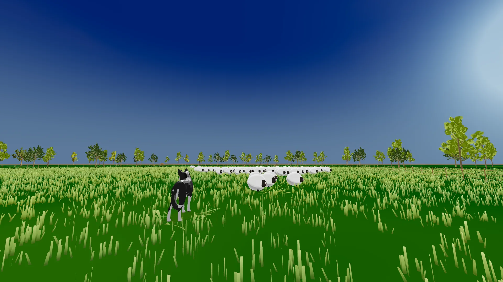
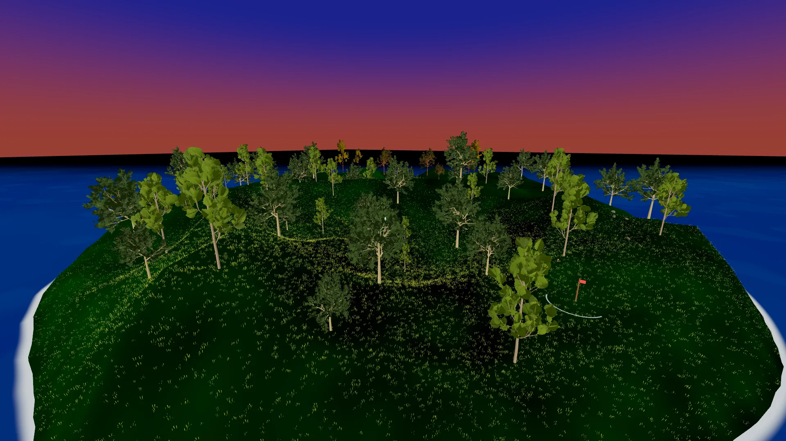
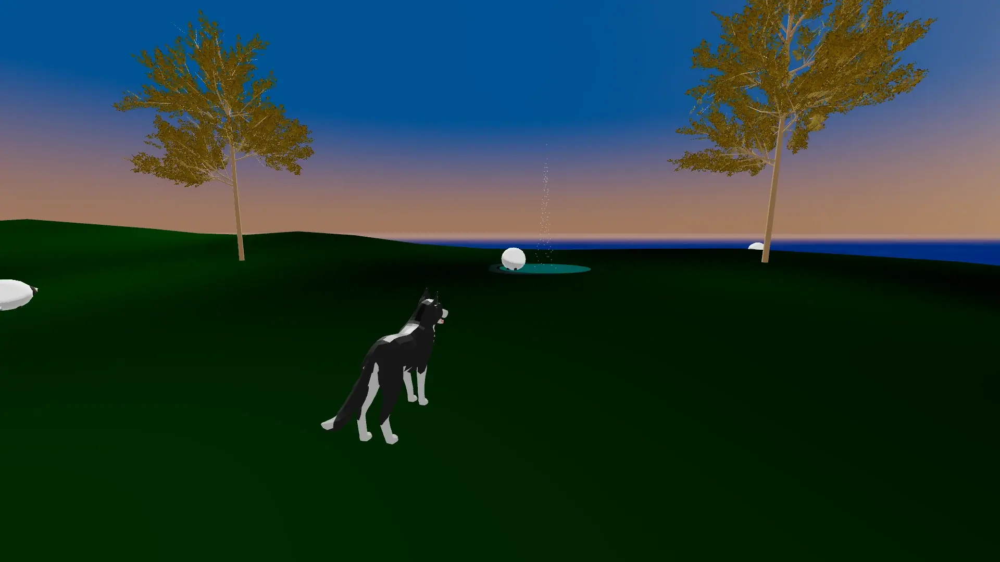
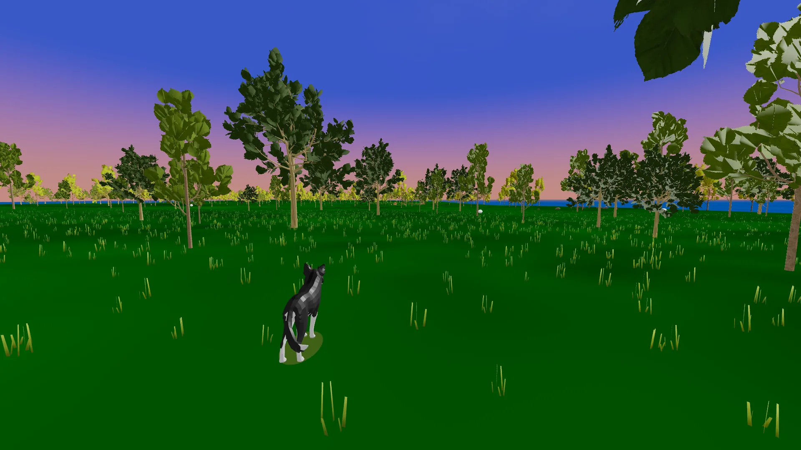

# Sheep Dog Sim

[](https://sheepdogsim.com) [](LICENSE) [](LICENSE-ASSETS) [](https://github.com/matthew-kissinger/sds)

[](https://threejs.org/) [](https://react.dev/) [](https://vite.dev/) [](https://tailwindcss.com/) [](https://developers.cloudflare.com/workers/) [](https://vitest.dev/)

**Sheep Dog Sim is a free browser herding game with three public scenes, solo challenges, 2-4 player online multiplayer, mobile controls, gamepad support, and flocks that scale up to 5,000 sheep.** Play at [sheepdogsim.com](https://sheepdogsim.com). No install, no signup, no ads.

Current code is AGPL-3.0-or-later. Current non-code assets are CC BY-SA 4.0. Hosted or modified versions must publish corresponding source and preserve attribution.

## Current Captures

| Home Field | Rolling Hills | Open Country | Newsheepdogland lab |
|---|---|---|---|
|  |  |  |  |

## What You Can Play

Sheep Dog Sim is built around pressure, flock shape, and terrain. Get behind the sheep, push gently, block breaks, and drive the flock toward the objective before it spills into water, trees, gates, or its own momentum.

Scenes:

- **Home Field** - flat fenced starter pasture with one gate.
- **Rolling Hills** - 180 m golden-hour island with shoreline water and a lightning corral.
- **Open Country** - 380 m island with a multi-stage gather-and-portal objective.
- **Newsheepdogland** - gated large-scene lab with a homestead pen and day/night pressure. It remains out of the public beta scene set while the larger loop is reconsidered.

Modes:

- **Just Play** - 30 sheep, no timer, no fail state.
- **Solo Classic** - 200 sheep with leaderboard scoring.
- **Solo Extreme** - 1,000 sheep.
- **Solo Insane** - 3,000 sheep.
- **Solo Chaos** - 5,000 sheep.
- **Multiplayer** - 2-4 player real-time co-op, competitive, timed rooms, split-screen, and sandbox/editor flows.

## Why This Repo Exists

Most browser 3D games are either thin demos or closed-source ports. Sheep Dog Sim is a complete browser-first game whose source can be read end-to-end:

- vanilla JavaScript client code with React 19 UI via `React.createElement`, no JSX;
- Three.js 0.185 renderer paths with WebGL fallback and progressive WebGPU on supported hardware;
- Vite 7 and Tailwind 4 for the web app;
- Cloudflare Worker, Durable Objects, and D1 for multiplayer, rooms, scores, and identity;
- deterministic `shared/` boid, movement, obstacle, objective, terrain, and scene modules imported byte-identically by the browser and Worker;
- Vitest, Playwright, sim-baseline goldens, refactor-baseline characterization tests, and an ESLint boundary around `shared/`.

## Run Locally

Requires Node 22+.

```bash
git clone https://github.com/matthew-kissinger/sds.git
cd sds
npm install
npm run dev:setup
npm run dev
```

Open [http://localhost:3000](http://localhost:3000).

Useful commands:

```bash
npm run dev:client
npm run dev:worker
npm run dev:lan

npm test
npm run lint
npm run test:e2e
npm run test:ios-water
npm run build
BUILD_TARGET=itchio npm run build
npm run native:check
```

URL helpers:

- `?scene=field`
- `?scene=rolling-hills`
- `?scene=open-country`
- `?scene=newsheepdogland` - gated lab/deep-link testing only
- `?renderer=webgpu`
- `?renderer=webgl`
- `?cinematic=1`
- `?ui=off`
- `?sun=0.20`

## Controls

| Input | Desktop | Mobile |
|---|---|---|
| Move | W A S D / arrows | Virtual joystick |
| Sprint | Shift | Sprint button |
| Bark | Space / gamepad RB | Bark button |
| Camera | C | Camera chip |
| Zoom | Mouse wheel | Slider |
| Pause | Escape | Pause button |
| Gamepad | Full analog support | Browser-dependent |

Camera modes are Classic, Follow, and Free. Per-scene camera preference is stored locally.

## Architecture

```text
Client: Cloudflare Pages
  React UI, Three.js renderers, input, audio, terrain, atmosphere, foliage, scenes
  |
  | imports byte-identical deterministic modules
  v
shared/
  boids, movement, objectives, scene data, terrain heightfield, obstacle contracts
  ^
  | imports byte-identical deterministic modules
  |
Worker: Cloudflare Workers + Durable Objects + D1
  RoomDO, LobbyDO, 60 Hz GameSim, MessagePack WebSocket frames, scores, identity
```

The deterministic boundary matters. Never import DOM, `window`, Three.js, or `js/` modules into `shared/`. Multiplayer drift is caught by sim-baseline fixtures and Worker/client tests.

Full details: [ARCHITECTURE.md](ARCHITECTURE.md), [DEVELOPMENT.md](DEVELOPMENT.md), [docs/INTERFACE_FENCE.md](docs/INTERFACE_FENCE.md).

## Deployment State

- Canonical web game: [sheepdogsim.com](https://sheepdogsim.com)
- Production backend: Cloudflare Worker `sds-worker` with D1 `sds-db`
- PR preview backend: isolated Worker `sds-worker-preview` with D1 `sds-db-preview`
- Itch target: deferred; `npm run build:itchio` remains available for future owner-approved distribution work
- Native target: Electron Windows package path exists, but public Steam submission remains a long-term target pending beta demand, current package proof, signing/store decisions, metadata, screenshots/capsules, install/uninstall QA, and human approval

The repo is currently in a launch-readiness program:

- Cycle 106 - docs and repo hygiene
- Cycle 107 - SEO and site content
- Cycle 108 - release-candidate proof
- Cycle 109 - native desktop and Steam readiness
- Cycle 110 - itch, portals, and final launch review
- Cycle 111 - core bark, onboarding, leaderboard, and completion UX

## Release State

The current player-visible release line is `v2.6.2 beta`: the `v2.6.0` web beta posture with WebGPU Counting Sheep, controller menu, camera zoom, and tutorial framing hotfixes. The beta remains web-only with three public scenes, support/privacy surfaces, leaderboard-season planning, community/playtest scaffolding, and the continued Newsheepdogland lab gate.

No store upload, Steam submission, paid platform action, or third-party portal publication is implied by this README. Those remain separate owner-approved actions.

## Contributing

Recommended reading order:

1. [ARCHITECTURE.md](ARCHITECTURE.md)
2. [DEVELOPMENT.md](DEVELOPMENT.md)
3. [DECISIONS.md](DECISIONS.md)
4. [docs/BACKLOG.md](docs/BACKLOG.md)
5. [docs/INTERFACE_FENCE.md](docs/INTERFACE_FENCE.md)
6. [docs/README.md](docs/README.md)

Good contribution areas:

- language packs under [js/locales/](js/locales/);
- small HUD comfort fixes;
- mobile device proof;
- native packaging QA;
- portal-specific distribution research;
- mod/gallery experiments that preserve the AGPL and asset attribution requirements.

## License

Source code: [AGPL-3.0-or-later](LICENSE).
Current non-code assets: [CC BY-SA 4.0](LICENSE-ASSETS).
Historical release terms: [LICENSING.md](LICENSING.md).
