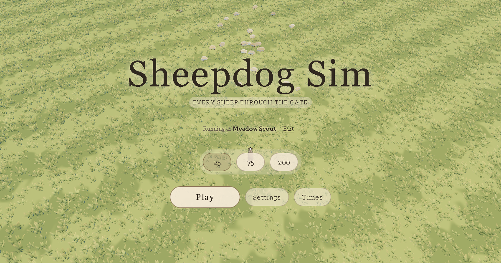

# Sheepdog Sim

Sheepdog Sim is a browser game about one dog, one flock and one field. Get
behind the sheep, apply pressure carefully and guide every animal through the
gate into the attached pen.



The version 3.0 release focuses on the complete single-player loop:

- 25, 75 or 200 sheep;
- move, sprint and bark;
- Classic and Follow cameras;
- keyboard, gamepad and touch controls;
- local personal best times;
- optional online solo times for each flock size;
- a server-random running name that can be edited;
- WebGPU rendering with automatic WebGL2 fallback;
- no account, multiplayer or 5,000-sheep mode.

Online identity and score requests are fail-soft. Play, completion and local
personal bests continue when the score service is unavailable.

Play the current public release at [sheepdogsim.com](https://sheepdogsim.com).
This repository is the current Sheepdog Sim 3 codebase. Production releases
are built from an exact commit and expose that identity in `release.json`.

## Controls

| Action | Keyboard | Gamepad | Touch |
| --- | --- | --- | --- |
| Move | W A S D or arrows | Left stick | Left joystick |
| Sprint | Shift | Left trigger | Sprint button |
| Bark | Space | Right shoulder | Bark button |
| Change camera | C | Y / Triangle | Camera button |
| Pause | Escape | Menu | Pause button |

Controls can be remapped in Settings. Reduced motion, quality, audio levels and
a colorblind dog marker are also available there.

## Run locally

Requirements:

- Node.js 22 or newer;
- a current browser with WebGPU or WebGL2.

```bash
git clone https://github.com/matthew-kissinger/sds.git
cd sds
npm ci
npm run dev
```

Open the local URL printed by Vite.

Useful commands:

```bash
npm test
npm run lint
npm run build
npm run preview
node tools/determinism-crosscheck.mjs
npm run probe:release
```

## Architecture

The application is split into four deliberate boundaries:

```text
sim/       deterministic fixed-step herding simulation
app/       React, Three.js, input, audio and player interface
assets/    runtime assets plus editable sources and bake manifests
tools/     deterministic bakes, diagnostics and release verification
```

The simulation imports no Three.js, React, DOM or network code. The renderer
uses one TSL material path for WebGPU and WebGL2. Zustand is the shared state
authority for the scene and player interface.

The field is assembled from reproducible source:

- terrain, grass, treeline and scatter placement are deterministic bakes;
- the treeline uses the CC0 Fox Trees Pack Round and Spreading sources, adapted
  into a deterministic cel-shaded family with no runtime model loading;
- sheep, dog, fences and farm structures are code-authored geometry;
- material and atmosphere systems are TSL source;
- every audio file is deterministic in-repo synthesis with a runnable recipe
  and digest ledger;
- authoring concepts are retained separately from runtime assets.

Read [the version 3 architecture reset](docs/architecture/v3-reset.md) for what
was retained from version 2, what was removed and why the codebase was rebuilt.

## Release discipline

A production candidate must pass:

- clean install, lint, typecheck, unit tests and deterministic fixtures;
- a production build and static preview;
- a built-artifact scan that permits only the score REST client and excludes
  rooms, WebSockets, multiplayer, deferred scale and debug code;
- complete 25, 75 and 200 sheep runs on both renderer backends;
- desktop and mobile interaction, layout and audio checks;
- asset source, license, secret and local-artifact checks;
- exact commit identity in the deployed `release.json`;
- a tested static rollback to the last version 2 Pages deployment.

Public builds contain no multiplayer client, room flow, bundled Worker or
5,000-sheep code. Solo-time boards use the existing score service through the
isolated `field-v3` partition. Multiplayer remains a future product decision,
not a dormant launch flag.

## Contributing

Start with [CONTRIBUTING.md](CONTRIBUTING.md), then read
[AGENTS.md](AGENTS.md) and the relevant document under [spec/](spec/). The spec
is the product contract. When implementation and spec disagree, document the
decision rather than adding a compatibility branch.

Bug reports should include the browser, device, renderer backend, flock size,
seed when known, reproduction steps and console output. Security issues should
follow [SECURITY.md](SECURITY.md).

## License

Source code is licensed under
[GNU AGPL-3.0-or-later](https://www.gnu.org/licenses/agpl-3.0.html), copyright
Matthew Kissinger.

Runtime and authoring assets are covered by the asset ledger and
`LICENSE-ASSETS`. Do not assume a code license applies to third-party or
generated media. Hosted modified versions must provide corresponding source and
retain the applicable notices.
